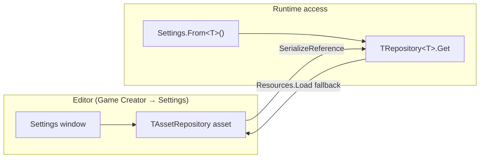

# Repositories & Settings

Game Creator 2 uses a **Repository** pattern to store **project-wide module settings** — the data behind **Game Creator → Settings** (`Ctrl+K` / `Cmd+K`).


**Not a database repository.** In GC2, *Repository* means a serializable settings container tied to a Settings tab (General, Variables, Inventory, Stats, and so on). It is framework plumbing, not a generic CRUD layer.


## At a glance

| Piece | What it is |
| --- | --- |
| **`IRepository`** | Minimal contract: a unique `RepositoryID` and the folder where its asset lives. |
| **`TRepository<T>`** | Serializable **data class** for one module's settings. Accessed at runtime through a cached singleton. |
| **`AssetRepository<T>`** | `ScriptableObject` wrapper that holds the repository so Unity can save it. |
| **`*Settings`** | Concrete asset class (for example `InventorySettings`) that defines the tab **name**, **icon**, and **priority** in the Settings window. |
| **`Settings.From<T>()`** | Public runtime API to read any repository. |

## How the pieces connect



1. Each module defines a **`TRepository<T>`** subclass with serialized fields (catalogues, registries, mixers, and so on).
2. A matching **`*Settings`** asset (`AssetRepository<T>`) wraps that data in a `ScriptableObject`.
3. The Settings window discovers every `TAssetRepository` in the project and lists them in the sidebar.
4. At runtime, code reads settings through **`Settings.From<MyRepository>()`** or **`MyRepository.Get`**.

## Built-in repositories (Core and modules)

| Repository ID | Settings tab | Typical contents |
| --- | --- | --- |
| `core.general` | General | Audio mixers, save defaults |
| `core.variables` | Variables | Registry of global Name/List variable assets |
| `core.welcome` | Welcome | Welcome screen and startup behavior |
| `core.updates` | Updates | Version and update notifications |
| `inventory.general` | Inventory | Item catalogue |
| `stats.general` | Stats | Status effects registry |

Additional modules follow the same pattern with their own ID (for example `abilities.general` for third-party modules).

## Where assets live

Settings assets are stored under the Game Creator **Data** folder (Logic/Data split):

```
Assets/Plugins/GameCreator/Data/Resources/Settings/{RepositoryID}.asset
```

On editor load, GC2 scans for every `TAssetRepository` subclass. If the expected `.asset` file is missing, it **creates one automatically** at the path above.


Keep Logic (scripts) under `Packages/` and Data (generated settings assets) under `Data/`. Module builds usually ship Logic only so user settings are not overwritten on update.


## Reading settings at runtime

Use the `GameCreator.Runtime.Common` namespace:

```csharp
using GameCreator.Runtime.Common;
using GameCreator.Runtime.Inventory;

// Via Settings helper (preferred)
Catalogue items = Settings.From<InventoryRepository>().Items;

// Direct singleton access also works
VariablesRepository.Get.Variables;
```

Common examples in shipped modules:

- **Audio channels** — `Settings.From<GeneralRepository>().Audio.musicMixer`
- **Item lookup** — `Settings.From<InventoryRepository>().Items.Get(itemId)`
- **Status effects** — `Settings.From<StatsRepository>().StatusEffects`

## Settings window behavior

- **Menu:** `Game Creator → Settings` (shortcut `Ctrl+K` / `Cmd+K`)
- **Discovery:** Finds all `TAssetRepository` assets in the project
- **Ordering:** Sidebar tabs sorted by `Priority` (General uses `0`)
- **Inspector:** Each tab edits the serialized `m_Repository` field on the asset
- **Select Asset:** Toolbar button pings the underlying `.asset` in the Project window

Some tabs use a custom editor (Welcome) or a full-screen layout (`IsFullScreen`) for richer UI.

## Editor cache and Play Mode

`TRepository<T>` caches its instance in a static field. In the editor, repositories reset that cache when entering Play Mode so inspector changes are picked up cleanly.

Module repositories typically include an `[InitializeOnEnterPlayMode]` handler that sets `Instance = null`. Follow the same pattern when adding your own repository.

## How catalogues stay in sync

Several repositories do not expect you to hand-maintain long asset lists. Instead, **editor post-processors** scan the project and write references into the repository:

- **Variables** — finds all `GlobalNameVariables` and `GlobalListVariables` assets
- **Inventory** — finds all `Item` assets and refreshes the catalogue

That is why actions like **Refresh** in the Inventory Settings tab repopulate the list from project assets. If you build a module with a similar registry, an `AssetPostprocessor` or `SettingsWindow.InitRunners` hook is the established pattern.

## Adding settings to a custom module

Use this checklist when your module needs its own Settings tab.

### 1. Define the data repository

```csharp
using System;
using GameCreator.Runtime.Common;
using UnityEngine;

[Serializable]
public class MyModuleRepository : TRepository<MyModuleRepository>
{
    public override string RepositoryID => "mymodule.general";

    [SerializeField] private MyCatalogue m_Catalogue = new MyCatalogue();

    public MyCatalogue Catalogue => m_Catalogue;

#if UNITY_EDITOR
    [UnityEditor.InitializeOnEnterPlayMode]
    private static void ResetOnPlayMode() => Instance = null;
#endif
}
```

**Repository ID rules:**

- Must be **unique** across the project
- Becomes the **filename** (`mymodule.general.asset`)
- Convention: `{module}.{scope}` (matches shipped IDs like `core.variables`, `inventory.general`)

### 2. Define the Settings asset

```csharp
using GameCreator.Runtime.Common;

public class MyModuleSettings : AssetRepository<MyModuleRepository>
{
    public override IIcon Icon => new IconItem(ColorTheme.Type.TextLight);
    public override string Name => "My Module";
    // public override int Priority => 50; // optional; lower = higher in list
}
```

Once Unity compiles this type, GC2 auto-creates the `.asset` on next domain reload if it does not exist yet.

### 3. (Optional) Custom Settings editor

Inherit `TAssetRepositoryEditor` and override `CreateContent` for extra buttons or layout — same approach as the Welcome tab.

### 4. (Optional) Auto-sync project assets

If your repository holds a registry of ScriptableObjects, add an editor post-processor (see Inventory/Variables modules) that updates the serialized list when assets are imported or deleted.

### 5. Read values from gameplay code

```csharp
var settings = Settings.From<MyModuleRepository>();
MyEntry entry = settings.Catalogue.Get(someId);
```

## Related pages

- [Variables](../core-functionality/variables.md) — global variable assets registered in `VariablesRepository`
- [Saving](../core-functionality/saving.md) — save defaults live in `GeneralRepository`
- [Code — Core overview](overview.md) — other developer extension points

Official advanced docs: [Game Creator Advanced](https://docs.gamecreator.io/gamecreator/advanced/)
