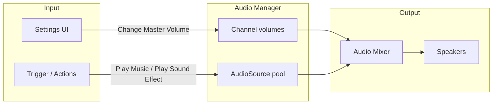

# Audio

Game Creator 2 manages sound through a centralized **Audio Manager** with separate **channels** for different kinds of audio. You play clips, adjust volume, and switch mixer snapshots from visual scripting — without manually creating and destroying `AudioSource` components for every sound.

This page covers **how the system works**. For **Trigger** events that react to volume changes, see [Audio Triggers](../visual-scripting/audio.md). For playback and volume instructions, see [Instructions → Audio](../visual-scripting/instructions.md).

---

## Core concepts

| Concept | Role |
| ------- | ---- |
| **Audio Manager** | Runtime singleton that creates, pools, and destroys `AudioSource` instances as needed. |
| **Channels** | Logical groups (Ambient, Music, SFX, Speech, UI) with independent volume sliders. |
| **Master volume** | Global multiplier applied on top of every channel. |
| **Instructions** | Visual scripting steps such as **Play Music**, **Change Music Volume**, and **Fade All Ambient**. |
| **Triggers** | Events such as **On Change Music Volume** that run Actions when a channel's volume changes. |

Think of channels as **mix busses**: each type of sound goes through its own volume control, and **Master** scales everything at once (useful for settings menus and mute-all behavior).

---

## Audio channels

GC2 Core provides five playback channels plus a master volume control:

| Channel | Typical use | Main instructions |
| ------- | ----------- | ----------------- |
| **Ambient** | Looping environmental beds (wind, crowd murmur, machinery) | **Play Ambient**, **Stop Ambient**, **Fade All Ambient** |
| **Music** | Background music (non-diegetic) | **Play Music**, **Stop Music**, **Fade All Music** |
| **Sound Effects** | One-shot gameplay sounds (impacts, pickups, doors) | **Play Sound Effect**, **Stop Sound Effect** |
| **Speech** | Character dialogue — one clip per character at a time | **Play Speech**, **Stop Speech On Game Object** |
| **UI** | Interface feedback (clicks, hovers, notifications) | **Play UI Sound** |

### Channel behavior notes

- **Sound Effects** and **Speech** can use **spatial blending** so sounds appear to come from a position in the world.
- **Music**, **UI**, and most **Ambient** usage is non-diegetic (not tied to a world position).
- **Speech** is bound to a **Target** GameObject so only one voice line plays per character at a time.
- The Audio Manager reuses sources efficiently — you request playback through instructions; GC2 handles the underlying `AudioSource` lifecycle.

### Sound variation

Repeated one-shot sounds (gunfire, footsteps on the same material) automatically receive slight **pitch** and **speed** variation so rapid playback does not sound mechanical.

---

## Volume system

Each channel has its own volume value from **0** (silent) to **1** (full). **Master volume** multiplies all channels.

| Control | Scope | Typical change instruction |
| ------- | ----- | -------------------------- |
| **Master** | All channels | **Change Master Volume** |
| **Ambient** | Ambient channel only | **Change Ambient Volume** |
| **Music** | Music channel only | **Change Music Volume** |
| **Sound Effects** | SFX channel only | **Change Sound Effects Volume** |
| **Speech** | Speech channel only | **Change Speech Volume** |
| **UI** | UI channel only | **Change UI Volume** |

Volume changes can be **instant** or **animated over time** using the **Transition** parameter on the change-volume instructions. When a volume value updates, the matching **On Change … Volume** trigger fires (see [Audio Triggers](../visual-scripting/audio.md)).


Changing **Master volume** fires **On Change Master Volume** only — it does not separately fire each channel's volume trigger. Channel triggers fire when that specific channel's level changes.


### Settings menu pattern

A common setup:

1. Store the player's preferred levels in **Global Variables** (or load from save data).
2. On slider change → run **Change Music Volume** (etc.) with a short **Transition** for smooth adjustment.
3. Optionally listen with **On Change Music Volume** to sync UI labels or persist the new value.

---

## Playback workflow

Typical audio flow in a GC2 project:

### Starting playback

1. Add an **Actions** list (on a Trigger, Character, or manager object).
2. Add an instruction from **Audio** → e.g. **Play Music**.
3. Assign an **Audio Clip**, optional **Transition In**, and channel-specific options (spatial blend, target, wait to complete).

### Stopping and fading

- **Stop Music**, **Stop Ambient**, etc. stop a specific clip (optionally with fade-out).
- **Fade All Music** / **Fade All Ambient** stop every active track on that channel — useful for scene transitions or entering combat.

---

## Audio Mixer and snapshots

GC2 integrates with Unity's **Audio Mixer**. Use **Change Snapshot** to blend between mixer snapshots over a **Transition** duration.

| Use case | Example |
| -------- | ------- |
| Indoor / outdoor reverb | Snapshot with different reverb send levels |
| Underwater or muffled combat | Low-pass filter snapshot |
| Pause menu | Reduced music and SFX snapshot |

You can also drive exposed mixer parameters with **Audio Mixer Parameter**, or adjust individual **Audio Source Volume** / **Audio Source Pitch** on specific sources.

---

## Reacting to volume changes

Six **Trigger** events in the **Audio** category fire when a volume level changes:

| Trigger | Fires when |
| ------- | ---------- |
| [On Change Master Volume](../visual-scripting/triggers/on-change-master-volume.md) | Master volume changes |
| [On Change Ambient Volume](../visual-scripting/triggers/on-change-ambient-volume.md) | Ambient channel volume changes |
| [On Change Music Volume](../visual-scripting/triggers/on-change-music-volume.md) | Music channel volume changes |
| [On Change Sound Effects Volume](../visual-scripting/triggers/on-change-sound-effects-volume.md) | SFX channel volume changes |
| [On Change Speech Volume](../visual-scripting/triggers/on-change-speech-volume.md) | Speech channel volume changes |
| [On Change UI Volume](../visual-scripting/triggers/on-change-ui-volume.md) | UI channel volume changes |

Place these on a **manager** or **settings UI** object. They have no inspector fields — they listen globally for that channel's volume updates.

See [Audio Triggers](../visual-scripting/audio.md) for full Trigger component documentation.

---

## Scene setup tips

- Keep one logical **audio manager** GameObject with Triggers for volume persistence and UI sync.
- Use **Fade All Music** before **Play Music** when switching BGM (battle stinger, area themes).
- Match channel choice to content: UI clicks on **UI**, voice lines on **Speech**, world impacts on **Sound Effects**.
- Test volume sliders with both instant and transitioned **Change … Volume** instructions — triggers fire when the value is committed, not necessarily when a fade finishes.

---

## Related

- [Audio Triggers](../visual-scripting/audio.md) — Trigger events for volume changes
- [Triggers](../visual-scripting/triggers.md) — full trigger catalog
- [Instructions](../visual-scripting/instructions.md) — Play, Stop, Fade, and Change Volume instructions
