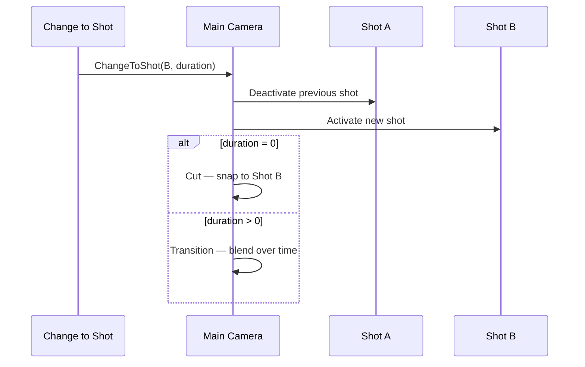

# Cameras

Game Creator 2 replaces the traditional single Unity camera workflow with a **shot-based camera system**. A **Main Camera** rig blends between multiple **Shot Camera** definitions. You switch angles in gameplay or cinematics without swapping camera GameObjects manually.

This page covers **how the system works**. For **Trigger** events that react to shot changes, see [Camera Triggers](../visual-scripting/cameras.md). For the instruction that performs a switch, see [Instructions → Cameras](../visual-scripting/instructions.md).

---

## Core components

| Component | Add Component menu | Role |
| --------- | ------------------ | ---- |
| **Main Camera** | Game Creator → Cameras → Main Camera | The live camera rig. Owns blending, viewport, shake, and which shot is currently active. |
| **Shot Camera** | Game Creator → Cameras → Shot Camera | A virtual camera **definition** — position, rotation, and behavior (Fixed, Follow, Third Person, Lock On, etc.). Many shots can exist in a scene; only one is active per Main Camera at a time. |

Think of **Shot Cameras** as presets or angles, and the **Main Camera** as the single output that moves between them.

---

## Shot types

Each Shot Camera uses a **Shot Type** that defines how it computes position and rotation:

| Shot Type | Typical use |
| --------- | ----------- |
| **Fixed** | Static cinematic angle |
| **Follow** | Track a target at an offset |
| **Third Person** | Over-the-shoulder or orbit gameplay camera |
| **Lock On** | Combat camera locked to a target |
| **Animation** | Driven by animation clips |
| **Track** | Move along a path |
| **Anchor Peek** | Peek around corners |

Configure shot types on the Shot Camera component in the Inspector. Shot types can reference targets (characters, transforms) that update every frame while the shot is active.

---

## Switching shots

Shot changes go through the Main Camera's **transition system**. The usual way to trigger a switch from visual scripting is the [**Change to Shot**](../visual-scripting/instructions.md) instruction (Cameras → Change to Shot).

| Parameter | Effect |
| --------- | ------ |
| **Camera** | Which Main Camera performs the switch (default: Main Camera) |
| **Shot** | Which Shot Camera becomes active |
| **Duration** | `0` = instant **cut**; greater than `0` = blended **transition** over that many seconds |
| **Easing** | Curve used during a transition |

### Cut vs transition


**Cut** — Duration is zero (or near zero). The Main Camera snaps to the new shot's position and rotation immediately.

**Transition** — Duration is greater than zero. The Main Camera blends from the previous shot to the new shot over time using the chosen easing.


### What happens during a switch

When `ChangeToShot` runs on a Main Camera:

1. The **previous** shot is deactivated → its cleanup logic runs.
2. The **new** shot is activated → its setup logic runs.
3. The Main Camera fires either a **cut** or **transition** event, depending on duration.

---

## Reacting to camera changes

You can respond to shot switches with **Trigger** events. GC2 Core provides three camera triggers; each watches a different part of the system:

| Trigger | Watches | Fires when |
| ------- | ------- | ---------- |
| [On Camera Change](../visual-scripting/triggers/on-camera-change.md) | Main Camera | Any shot switch on that camera (filterable by cut or transition) |
| [On Change to Shot](../visual-scripting/triggers/on-change-to-shot.md) | One Shot Camera | That shot becomes active |
| [On Change from Shot](../visual-scripting/triggers/on-change-from-shot.md) | One Shot Camera | That shot becomes inactive |

Use **On Camera Change** for global reactions (UI fades, input lock on any switch). Use **On Change to Shot** / **On Change from Shot** in pairs when logic is specific to one angle (enable UI on enter, disable on exit).

See [Camera Triggers](../visual-scripting/cameras.md) for full Trigger component documentation.

---

## Scene setup tips

- Mark one Shot Camera as **Main Shot** if it should be the default when the scene loads.
- Place Shot Cameras as children of logical groups (e.g. `Cameras/Cinematics/DialogueCloseUp`) for hierarchy clarity.
- Keep a single **Main Camera** as the render output; avoid multiple Main Cameras fighting unless you intentionally use multiple rigs.
- Test switches with both **cut** (`duration = 0`) and **transition** (`duration > 0`) — Trigger events behave differently depending on which you use.

---

## Related

- [Camera Triggers](../visual-scripting/cameras.md) — Trigger events for shot changes
- [Triggers](../visual-scripting/triggers.md) — full trigger catalog
- [Instructions](../visual-scripting/instructions.md) — Change to Shot and shot property instructions
