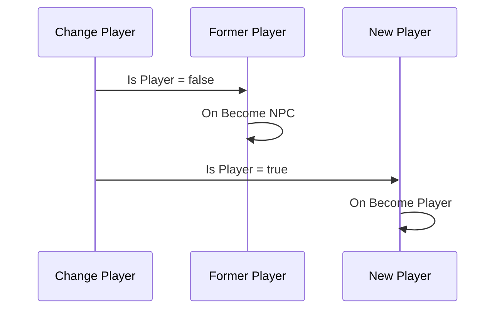
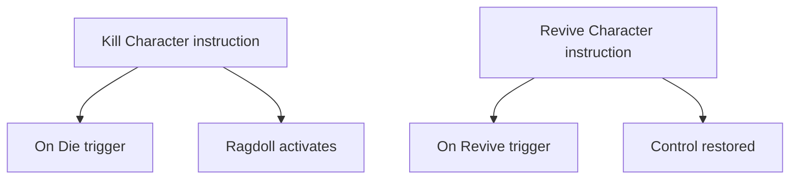

# Characters

In Game Creator 2, a **Character** is any moving entity in your scene — the player, NPCs, companions, or enemies. One **Character** component provides movement, rotation, animation, footsteps, inverse kinematics, ragdoll, interaction, and combat primitives. Other GC2 modules (Stats, Melee, Inventory, etc.) extend the same Character hub.

This page covers **how the system works**. For **Trigger** events at the Characters category root (player switch, model swap, death, revival), see [Character Triggers](../visual-scripting/characters.md). For movement, animation, and property instructions, see [Instructions → Characters](../visual-scripting/instructions.md).

---

## Core concepts

| Concept | Role |
| ------- | ---- |
| **Character component** | The main component on a humanoid or creature GameObject. |
| **Kernel units** | Swappable modules inside the Character: Player, Motion, Driver, Rotation, Animation. |
| **Player** | The one Character in a scene with **Is Player** enabled — receives input through the Player unit. |
| **NPC** | Any Character that is not the current Player. |
| **Mannequin** | Intermediate transform between the Character root and the visible 3D model. |
| **Instructions** | Steps such as **Move To**, **Change Player**, **Kill Character**, **Change Model**. |
| **Triggers** | Events such as **On Die** and **On Become Player** that run Actions on lifecycle changes. |

Adding **Game Creator → Characters → Player** (or **Character**) to the hierarchy gives you a ready-made setup with motion, driver, and animation defaults.

---

## Character component overview

The Inspector organizes the Character into logical blocks:

| Section | Purpose |
| ------- | ------- |
| **General** | **Is Player** flag, debug mannequin icon (green = normal, red limbs = busy, skull = dead). |
| **Kernel** | The five units that drive behavior (see below). |
| **Inverse Kinematics** | Feet grounding, look-at, lean, and custom IK rigs. |
| **Footsteps** | Material-based footstep sounds tied to ground textures. |
| **Ragdoll** | Skeleton asset, get-up animations, ragdoll recovery. |
| **Animation** | Model reference, states, gestures, locomotion. |

### The kernel (five units)

The **kernel** splits behavior into independently swappable **units**:

| Unit | Role | Common options |
| ---- | ---- | -------------- |
| **Player** | Reads user input when **Is Player** is on | Directional, Point & Click, Tank |
| **Motion** | Speed, acceleration, gravity, jump commands | Motion Controller |
| **Driver** | Applies motion to the transform | Character Controller, NavMesh Agent, Rigidbody |
| **Rotation** | Which way the body faces | Pivot, Look at Target, Tank, Towards Direction |
| **Animation (Animim)** | Model display and animation playback | Kinematic |

Switch unit implementations from the icon at the right edge of each unit row in the Inspector.

#### Player unit options

| Option | Best for |
| ------ | -------- |
| **Directional** | WASD / left stick relative to camera — standard 3D action and RPG |
| **Point & Click** | Click-to-move; pair with **NavMesh Agent** driver for pathfinding |
| **Tank** | Forward moves in local forward direction — fixed-camera horror |

When **Is Player** is off, the Player unit does not process input — the Character is an NPC driven by AI, cutscenes, or **Move To** / **Move Direction** instructions.

---

## Player vs NPC

Only **one Character** can be the Player at a time in a scene.

| State | **Is Player** | Input | Typical control |
| ----- | ------------- | ----- | --------------- |
| **Player** | ON | Player unit active | Keyboard, gamepad, touch |
| **NPC** | OFF | Player unit ignored | Behavior trees, Actions, NavMesh |

### Switching the Player

Use the **Change Player** instruction (**Characters → Player → Change Player**) to transfer control to another Character:

1. The previous Player's **Is Player** flag turns off → [On Become NPC](../visual-scripting/triggers/on-become-npc.md) fires on that Character.
2. The new Character's **Is Player** flag turns on → [On Become Player](../visual-scripting/triggers/on-become-player.md) fires on that Character.

Place **On Become Player** / **On Become NPC** triggers **on the Character GameObject** (or ensure **Self** refers to the Character you care about).

---

## Models and appearance

The visible mesh lives under the Character's **Animation** section. The **Mannequin** transform sits between the Character root and the model — useful for offsets without moving the collision capsule.

| Action | How |
| ------ | --- |
| Swap model in editor | Drag a prefab or model into the Animation section |
| Swap at runtime | **Change Model** instruction — optional Skeleton, Footstep Sounds, offset |
| Attach props | **Attach Prop**, **Remove Prop**, **Drop Prop** |
| Equipment meshes | **Put On Skin Mesh**, **Take Off Skin Mesh** |

When **Change Model** completes, [On Change Model](../visual-scripting/triggers/on-change-model.md) fires on that Character.

---

## Death and revival

Death is a Character **state**, not just an animation.

| Instruction | Effect |
| ----------- | ------ |
| **Kill Character** | Enters death state, disables interaction, typically activates ragdoll |
| **Revive Character** | Leaves death state, plays get-up animation, restores control |

### Typical death flow

- [On Die](../visual-scripting/triggers/on-die.md) runs when the Character enters the death state (from **Kill Character**, Stats health reaching zero, or module-specific damage).
- [On Revive](../visual-scripting/triggers/on-revive.md) runs when the Character leaves death state via **Revive Character** (or equivalent module logic).

Ragdoll-specific triggers (**On Start Ragdoll**, **On Recover Ragdoll**) live under a separate Characters subcategory — see [Triggers](../visual-scripting/triggers.md).

Configure **Skeleton** assets and get-up clips (**Recover Face Down**, **Recover Face Up**) in the Character's Ragdoll section for smooth recovery.

---

## Reacting to character lifecycle

Five **Trigger** events sit at the root of the **Characters** category:

| Trigger | Fires when |
| ------- | ---------- |
| [On Become Player](../visual-scripting/triggers/on-become-player.md) | This Character becomes the Player |
| [On Become NPC](../visual-scripting/triggers/on-become-npc.md) | This Character stops being the Player |
| [On Change Model](../visual-scripting/triggers/on-change-model.md) | This Character's model is swapped |
| [On Die](../visual-scripting/triggers/on-die.md) | This Character dies |
| [On Revive](../visual-scripting/triggers/on-revive.md) | This Character revives from death |

These events are **Character-scoped**: add the Trigger to the Character GameObject (recommended) so **Self** is that Character. Combat, navigation, and ragdoll triggers are documented separately on the main [Triggers](../visual-scripting/triggers.md) page.

See [Character Triggers](../visual-scripting/characters.md) for comparison tables and common patterns.

---

## Scene setup tips

- Create the Player via **Game Creator → Characters → Player** so **Is Player**, camera, and default units are preconfigured.
- Pair **NavMesh Agent** driver with **Point & Click** Player unit for click-to-move RPGs.
- Use **Is Controllable** to block input during cutscenes without removing Player status.
- Put **On Die** on the Character for local feedback (animation, disable collider); use a manager for global logic (game over UI) if needed.
- After **Change Player**, update camera targets and UI portraits in **On Become Player** on the new Character.

---

## Related

- [Character Triggers](../visual-scripting/characters.md) — Trigger events for player switch, model, death, revival
- [Triggers](../visual-scripting/triggers.md) — full trigger catalog (combat, navigation, ragdoll)
- [Instructions](../visual-scripting/instructions.md) — Move, Animate, Kill, Revive, Change Player
