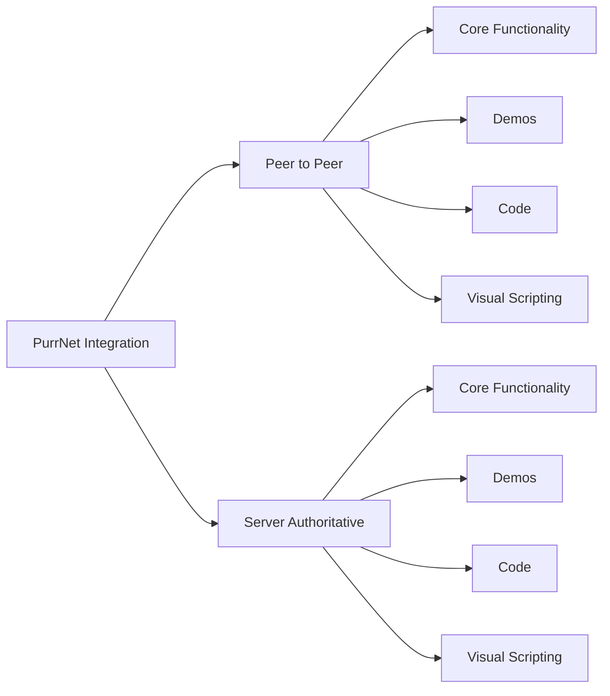

# Arawn PurrNet Integration


**Third-party extension.** Requires the [Arawn Agnostic Networking Layer](../gc2-arawn-agnostic-networking/README.md) and a licensed **PurrNet** install. Not official Game Creator 2.


---

## What this integration is

The **PurrNet transport** is the first-class networking stack shipped with the Arawn GC2 Networking Layer. It implements **NetworkTransportBridge** and module-specific PurrNet bridges so GC2 characters, variables, animation, and optional modules replicate over PurrNet.

Key pieces shared across multiplayer modes:

- **PurrNetTransportBridge** — core input/state packet flow
- **Module bridges** — Stats, Inventory, Melee, Shooter, Quests, Dialogue, Traversal, Abilities (per installed GC2 modules)
- **PurrNet Scene Setup Wizard** — `Game Creator > Networking Layer > PurrNet Scene Setup Wizard`
- **NetworkSessionProfile** — tick rate, broadcast rates, interpolation

Requires the agnostic layer for managers, session profiles, and authority rules.

---

## Choose a multiplayer mode

This space is organized **mode-first**. Pick the topology that matches your game, then use that mode’s Core Functionality, Demos, Code, and Visual Scripting pages.

| Mode | When to use | Start here |
|------|-------------|------------|
| **Peer to Peer** | Player-hosted sessions: one machine hosts (listen server), others join over LAN/internet; local multiplayer testing; small groups without a dedicated process | [Peer to Peer Overview](peer-to-peer/overview.md) |
| **Server Authoritative** | Dedicated game server process; cloud hosting and orchestration (for example Edgegap); stronger anti-cheat and scale | [Server Authoritative Overview](server-authoritative/overview.md) |

Each mode mirrors the same documentation framework:

| Section | Purpose |
|---------|---------|
| **Overview** | Mode goals, when to choose it, typical flow |
| **Core Functionality** | Setup, bridges, ownership, transport options for that mode |
| **Demos** | Sample scenes and mode-specific test setups |
| **Code** | Extension notes and public surfaces for that mode |
| **Triggers / Instructions / Conditions** | Visual Scripting catalog for that mode |

---

## Prerequisites

1. Install the [Arawn Agnostic Networking Layer](../gc2-arawn-agnostic-networking/README.md).
2. Install **PurrNet** and the GC2 modules your game needs.
3. Open the **PurrNet Scene Setup Wizard** (or build scenes manually) for your chosen mode.
4. Tune **NetworkSessionProfile** after your first successful host/join or deploy.

---

## Related spaces

- [Arawn Agnostic Networking Layer](../gc2-arawn-agnostic-networking/README.md) — transport-independent core
- [Arawn Photon Integration](../gc2-arawn-photon/README.md) — alternative transport
- [Edgegap documentation](https://docs.edgegap.com/) — dedicated server hosting and orchestration (Server Authoritative path)

## Documentation status

**Scaffold.** Mode trees are in place. Expand content from your licensed local install; do not commit Arawn or PurrNet source.
