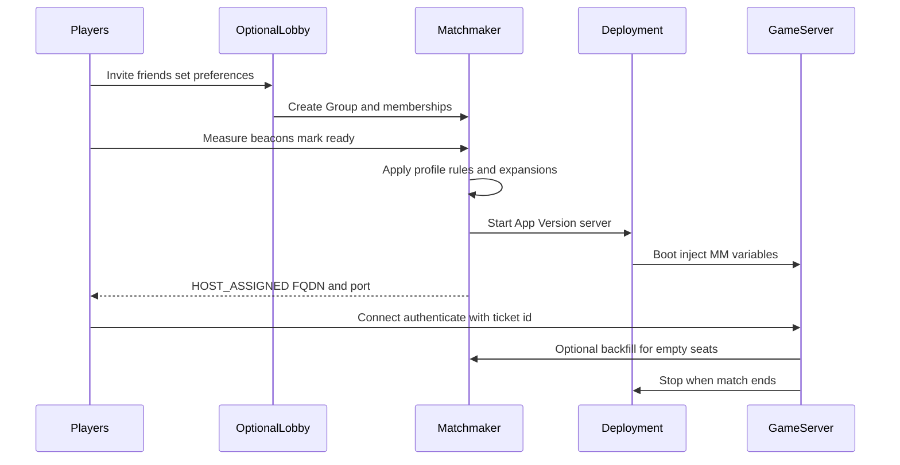

# Edgegap — Matchmaking

This page teaches you how to run a **complete server-authoritative matchmaking system** with Edgegap: players queue with real game rules, Edgegap starts a **dedicated server Deployment**, everyone receives connection details, your **PurrNet + Arawn** clients join, the match plays, leavers can be replaced, and empty servers shut down.


**Prerequisite:** Finish [Configuration and Setup](configuration-and-setup.md) until a **manual** cloud Deployment accepts your client. Matchmaking only automates that last mile — it cannot fix a broken server image.



Official references: [Matchmaking overview](https://docs.edgegap.com/learn/matchmaking) · [Matchmaker in depth](https://docs.edgegap.com/learn/matchmaking/matchmaker-in-depth) · [Ping Beacons](https://docs.edgegap.com/learn/orchestration/ping-beacons). Feature names and API fields follow Edgegap; always verify against their current docs when integrating.


---

## What matchmaking is (in plain language)

Imagine a smart receptionist for online matches:

1. Players say what they want (mode, map list, skill, party size).
2. The receptionist groups compatible players.
3. The receptionist asks Edgegap to **open a private room** (start a Deployment of your App Version).
4. Everyone gets the room address (FQDN + external port).
5. Your game clients walk in and your **dedicated server** runs authority.

Edgegap’s Matchmaker is that receptionist. Your **Lobby** (optional third-party service) is the waiting room where friends pick preferences before registering as a Matchmaker **Group**.

### Four data flows you must understand

| Flow | Who talks | Purpose |
|------|-----------|---------|
| **Matchmaking API** | Game **clients** ↔ Matchmaker | Groups, tickets/memberships, status, ping beacons |
| **Deployments API** | Matchmaker ↔ Edgegap hosting | Start/scale/stop dedicated servers |
| **Netcode transport** | Clients ↔ **Dedicated server** | Actual gameplay (PurrNet / Arawn) |
| **Backfill API** | **Server** (+ clients) ↔ Matchmaker | Add players to a match already running |

After release, the Matchmaker service should run **24/7** so players worldwide can queue. Free Tier shared clusters are for learning and shut down on a timer — production uses a **private cluster**.

---

## End-to-end player journey (production shape)



### Status words your UI should show

Players need clear feedback. Membership/ticket statuses you will see in Edgegap’s lifecycle:

| Status | What to tell the player |
|--------|-------------------------|
| **SEARCHING** | Looking for teammates / opponents… |
| **TEAM_FOUND** | Your team is set; still assembling the full match… |
| **MATCH_FOUND** | Match locked; starting a cloud server… |
| **HOST_ASSIGNED** | Server address ready — connecting… |
| **CANCELLED** | Queue cancelled or ticket expired |


Edgegap does **not** ask players to “accept match” in the default design — fewer dodges, faster time-to-play. Your UI should move players into a loading scene as soon as `HOST_ASSIGNED` arrives.


Poll membership status about every **3–5 seconds**. Save **group ID**, **membership/ticket ID**, and later **assignment** locally so a client crash can resume or reconnect.

---

## Building blocks

### 1. Hosting cluster

| Cluster | Use for |
|---------|---------|
| **Free / shared** | Learning; limited runtime after restart |
| **Private (Hobbyist / Studio / Enterprise)** | Live games; 24/7; higher rate limits |

Create **separate matchmakers** for **dev** and **production**. Never experiment on the live queue.

### 2. Configuration (JSON)

When you create or restart a Matchmaker, you upload a JSON config. It defines:

- Matchmaker **version** (semantic versioning — major upgrades need careful retesting)
- `inspect` (debug API — enable in dev, disable for live)
- `max_deployment_retry_count` (auto-retries if a deploy fails)
- Optional `allowed_cors_origins` for browser clients
- One or more **profiles** (queues)

### 3. Profiles (queues)

A **profile** is an isolated queue. Examples:

- `casual-coop`
- `ranked-5v5`
- `quickplay-ffa`

Each profile points at an Edgegap **Application name + App Version** (your dedicated server template: image, CPU, RAM, ports).


Splitting the player base into many profiles can **increase** queue times. Use multiple profiles when rules or hardware needs truly differ (casual vs ranked; 4-player coop vs 50-player social).


### 4. Auth token

Clients send:

```text
Authorization: <your-matchmaker-auth-token>
```

- Edgegap staff will **never** ask for your tokens.
- Regenerate if leaked.
- This Matchmaker token is meant for **game clients** (it does not grant full Edgegap account API power). Still treat it carefully and prefer environment-specific matchmakers.

---

## Matchmaking rules (the heart of your game design)

All rules under `rules.initial` must pass **at the same time** for players to be matched.

### Player count (`player_count`) — required, once

Defines how many **teams** and how many players per team.

| Mode idea | `team_count` | `min_team_size` | `max_team_size` | Total when full |
|-----------|--------------|-----------------|-----------------|-----------------|
| Coop 4 players | 1 | 4 | 4 | 4 |
| Free-for-all 10 | 1 | 10 | 10 | 10 |
| 5v5 ranked | 2 | 5 | 5 | 10 |
| Battle Royale squads | 20 | 3 | 3 | 60 |

Edgegap tries to **fill to max**. If time is almost up (expansion or expiration), it may start a **partial** match if at least `min_team_size` is met for the current expansion stage.

**Parties (groups)** never split across teams incorrectly: a group only joins a team if the whole group fits.

### Latency (`latencies`) — optional, once

Usually named something like `beacons` in config.

Players measure ping to [Ping Beacons](https://docs.edgegap.com/learn/orchestration/ping-beacons) and send a map of beacon → milliseconds.

| Attribute | Meaning |
|-----------|---------|
| `max_latency` | Discard beacons slower than this for a player |
| `difference` | Players should be within this many ms of each other on a **shared** usable beacon |

Reload the beacon list before each matchmaking round — beacons scale/change over time.

### String equality (`string_equality`)

Players match only if they share the **exact** same string (case-sensitive).

Use for: `selected_game_mode` = `"ranked"` vs `"casual"` (note: `"Ranked"` ≠ `"ranked"`).

### Number difference (`number_difference`)

Players match if their numbers are within `max_difference`.

Use for: ELO / MMR / player level.

Group/team values use averages as described in Edgegap’s in-depth docs.

### Intersection (`intersection`)

Players each send a **list** of strings; they match if they share at least `overlap` values.

Use for: map votes (`["Airport","Vault"]`), allowed backfill sizes, moderation flags, preferred modes.

### Backfill group size (`intersection` pattern)

Special attribute players (and backfills) send so join-in-progress respects capacity. Typical client values:

| Value | Meaning |
|-------|---------|
| `"1"` | Solo queue |
| `"2"` (or `"3"`…) | Party size for this ticket |
| `"new"` | Willing to start a **new** match as well as join in-progress |

Servers advertise remaining capacity through backfill tickets (see [Backfill](#backfill-replace-leavers-and-fill-seats)).

---

## Rule expansions — soft start, then widen the net

**Expansions** change rule attributes after the player has waited a number of seconds. That keeps early matches high quality, then gradually allows longer queues to still find a game.

Example production timeline (teach the idea — tune for your genre):

| Time in queue | What you relax |
|---------------|----------------|
| 0s (initial) | Tight ping, tight skill, full lobby size |
| 30s | Allow higher ping and wider skill |
| 60s | Widen skill again |
| 180s | Allow smaller lobbies or almost any ping so someone can play |

Expansions **overwrite** the attributes they touch.


Design expansions on paper with your designers before coding UI. Bad expansions either trap players forever (too strict) or create unfair stomps (too loose too early).


---

## Parties, lobbies, and “play with friends”

### Matchmaker Group vs Lobby

| Need | Lobby (EOS, Steam, Nakama, PlayFab, custom, …) | Matchmaker Group |
|------|-----------------------------------------------|------------------|
| Invite friends | Yes | Yes |
| Edit preferences together | Yes | No |
| See others’ prefs | Yes | No |
| Custom lobby key/values | Yes | No |
| Ready-up & find match | No | Yes |
| Team assignment & server details | No | Yes |

**Recommended production pattern:**

1. Friends gather in a **Lobby**; pick mode/maps/difficulty there.
2. Lobby owner creates a Matchmaker **Group** and stores `group_id` in lobby shared data.
3. Members create **memberships** with the same `group_id` and their attribute payloads.
4. Everyone marks **ready** → queue starts.
5. After matchmaking begins, the group **cannot** be joined — late friends need a new group after abandon.

Solo players: create a group with a single ready membership so they queue alone.

### Abandon / cancel rules (teach your UI these)

- Owner deletes group → memberships cancel.
- Member leaves before find → only they leave; after find, leaving can cancel the **whole** group.
- After `HOST_ASSIGNED`, abandoning is a **server design** problem (AI fill, backfill, or continue short-handed). Give connect grace time (for example 60s) before calling someone a leaver.

---

## Client integration checklist (full system)

You can use Edgegap’s **Unity SDK** matchmaking samples as a starting skeleton, then replace “demo UI” with your real menus. The **behaviors** below are what a shipped game needs — not a two-ticket Swagger smoke test.

### A. Before queue

1. Authenticate the player in **your** identity system (Steam, Epic, custom). Matchmaker auth token alone is not anti-piracy.
2. Load ping beacons; measure RTT; build the `beacons` attribute object.
3. Gather match attributes from UI / lobby: mode, maps, skill, party size, moderation flags, etc.
4. Ensure attributes **match the rule names** in your profile JSON (names are your choice but must be consistent).

### B. Enter queue

1. Create or join **Group**.
2. Create **membership/ticket** with `profile` name + `attributes`.
3. Mark ready (solo: mark ready at creation to speed up).
4. Start status polling (3–5s) and drive UI from statuses.
5. Handle **429 Too Many Requests** with exponential backoff + jitter.
6. Handle **404** (ticket gone) and **500** (temporary outage) with clear player messaging.

### C. When `HOST_ASSIGNED`

1. Read assignment: **FQDN**, **ports** (use the named game port’s **external** value), location metadata if useful.
2. Persist assignment id / connection info for reconnect after client crash.
3. Show loading scene; begin **connect retries** to the dedicated server (server may still be initializing for seconds–minutes).
4. On connect, send your **ticket ID** (and any auth token your game uses) so the server can map you to injected Matchmaker data.

### D. Netcode join (Arawn / PurrNet)

1. Client sets transport address to assignment FQDN and **external** port.
2. Server (already running in the Deployment) accepts clients under your Arawn authority rules.
3. Do not tell players to open console commands — ship a Connect flow in UI / Visual Scripting later when those instructions are catalogued under this space.

### E. After the match

1. Server decides match over.
2. Server stops the Deployment (Edgegap SDK `DeploymentAgent` samples exist for this) so you do not pay for idle servers.
3. Clients return to lobby / menu; clear stale assignment state.

---

## Server integration checklist (authority side)

### Injected Matchmaker variables

When Matchmaker starts your Deployment, Edgegap injects environment variables such as (names illustrated in Edgegap docs):

| Variable pattern | Purpose |
|------------------|---------|
| `MM_MATCH_PROFILE` | Which profile created this match |
| `MM_EXPANSION` | Which expansion stage finalized the match |
| `MM_TICKET_IDS` | List of ticket ids in the match |
| `MM_TICKET_<id>` | Full ticket JSON per player (attributes, group, team) |
| `MM_GROUPS` / `MM_TEAMS` | How tickets nest into groups/teams |
| `MM_MATCH_ID` | Match identifier for logs |
| `MM_INTERSECTION` / `MM_EQUALITY` | Resolved shared rule results (for example chosen map) |

Values are often **stringified JSON** — parse carefully. Use them to:

- Pick the map / mode the intersection resolved
- Spawn the correct team loadouts
- Whitelist expected ticket IDs when clients connect
- Log tooling (also: deployments are tagged with ticket IDs for tracing)

Also read standard **Deployment** and **App Version** injected variables (public IP, ports mapping, custom secrets you defined on the version).

### Accept / kick players

Matchmaker finds players; **your server** still decides who may stay:

1. Client connects and announces ticket id (+ platform auth).
2. Server looks up that ticket in injected variables (or backfill `assigned_ticket`).
3. Accept into the correct team slot — or kick if unknown / banned / duplicate.

### Stop the server

Empty or finished matches should **stop the Deployment**. Otherwise costs climb and Free Tier capacity blocks new tests.

---

## Backfill — replace leavers and fill seats

**Backfill** is a **server-owned** ticket that represents “this running match still needs players.” New solo/party tickets can match into that backfill instead of only starting brand-new servers.

### When to use it

- Replace abandoners without restarting the match
- Allow mid-match join (friends or public)
- Keep social/MMO-style instances denser
- Spectators / special roles (advanced designs)

### How it works (operator view)

1. Server detects empty seats.
2. Server creates a **Backfill** per team that needs players, including:
   - Real **assignment** data from the Deployment
   - Ticket snapshots of players already connected
   - `backfill_group_size` candidates for remaining capacity (for example `["3","2","1"]` if three seats remain)
3. Queuing clients include compatible `backfill_group_size` values (`"1"`, party size, and optionally `"new"`).
4. Matchmaker assigns a group to the backfill → clients receive assignment → they connect to the **existing** server.
5. Repeat until full, renewing backfills before `ticket_expiration_period` deletes them.


Backfills ignore normal `player_count` fill logic in the sense Edgegap documents: each backfill matches **exactly one group**. Team capacity is controlled through `backfill_group_size` and round-robin fill behavior.


To **only** join existing matches (never start new ones from that queue behavior), Edgegap documents setting a very high `min_team_size` so ordinary matches cannot form — use carefully and only when that is truly your design.

---

## Production configuration strategy (full system, not a toy queue)

Below is a **teaching configuration** that combines the pieces a real game uses: multiple rules, expansions, and backfill hooks. Replace `application.name` / `version` with **your** Edgegap App Version. Adjust team sizes and thresholds to your design.


This is an **advanced** profile shape adapted from Edgegap’s documented complete examples. Validate JSON carefully (commas, quotes). Restart/redeploy matchmaker per Edgegap’s update rules when changing config.


```json
{
  "version": "3.2.5",
  "inspect": false,
  "max_deployment_retry_count": 3,
  "allowed_cors_origins": [
    "https://*.my-game.com"
  ],
  "profiles": {
    "ranked-standard": {
      "ticket_expiration_period": "5m",
      "ticket_removal_period": "1m",
      "group_inactivity_removal_period": "5m",
      "application": {
        "name": "my-game-server",
        "version": "REPLACE-WITH-YOUR-APP-VERSION"
      },
      "rules": {
        "initial": {
          "match_size": {
            "type": "player_count",
            "attributes": {
              "team_count": 2,
              "min_team_size": 5,
              "max_team_size": 5
            }
          },
          "beacons": {
            "type": "latencies",
            "attributes": {
              "difference": 125,
              "max_latency": 150
            }
          },
          "elo_rating": {
            "type": "number_difference",
            "attributes": {
              "max_difference": 50
            }
          },
          "selected_game_mode": {
            "type": "string_equality"
          },
          "selected_map": {
            "type": "intersection",
            "attributes": {
              "overlap": 1
            }
          },
          "backfill_group_size": {
            "type": "intersection",
            "attributes": {
              "overlap": 1
            }
          }
        },
        "expansions": {
          "30": {
            "elo_rating": {
              "max_difference": 100
            },
            "beacons": {
              "difference": 125,
              "max_latency": 220
            }
          },
          "90": {
            "elo_rating": {
              "max_difference": 150
            }
          },
          "180": {
            "match_size": {
              "team_count": 2,
              "min_team_size": 4,
              "max_team_size": 5
            },
            "beacons": {
              "difference": 99999,
              "max_latency": 99999
            }
          }
        }
      }
    },
    "coop-campaign": {
      "ticket_expiration_period": "3m",
      "ticket_removal_period": "1m",
      "group_inactivity_removal_period": "5m",
      "application": {
        "name": "my-game-server",
        "version": "REPLACE-WITH-YOUR-COOP-APP-VERSION"
      },
      "rules": {
        "initial": {
          "match_size": {
            "type": "player_count",
            "attributes": {
              "team_count": 1,
              "min_team_size": 4,
              "max_team_size": 4
            }
          },
          "beacons": {
            "type": "latencies",
            "attributes": {
              "difference": 125,
              "max_latency": 150
            }
          },
          "selected_difficulty": {
            "type": "string_equality"
          },
          "selected_map": {
            "type": "intersection",
            "attributes": {
              "overlap": 1
            }
          },
          "player_level": {
            "type": "number_difference",
            "attributes": {
              "max_difference": 10
            }
          },
          "backfill_group_size": {
            "type": "intersection",
            "attributes": {
              "overlap": 1
            }
          },
          "moderation_flags": {
            "type": "intersection",
            "attributes": {
              "overlap": 1
            }
          }
        },
        "expansions": {
          "30": {
            "beacons": {
              "difference": 125,
              "max_latency": 250
            },
            "player_level": {
              "max_difference": 20
            }
          },
          "60": {
            "match_size": {
              "team_count": 1,
              "min_team_size": 2,
              "max_team_size": 4
            }
          },
          "150": {
            "match_size": {
              "team_count": 1,
              "min_team_size": 1,
              "max_team_size": 4
            }
          }
        }
      }
    }
  }
}
```

### How to read this for your design meeting

- **`ranked-standard`**: two teams of five, tight skill + ping first, later allows slightly uneven teams and loosens ping so the queue does not die.
- **`coop-campaign`**: one team of four, shared difficulty, overlapping map votes, level bands, moderation separation, and backfill hooks; eventually allows starting with fewer humans (AI fill is your game code’s job).
- Point each profile at the App Version that has the right **CPU/RAM** for that mode’s player count.

Ticket lifetimes:

| Setting | Role |
|---------|------|
| `ticket_expiration_period` | Unmatched tickets become `CANCELLED` |
| `ticket_removal_period` | Expired tickets are deleted (404 if polled later) |
| `group_inactivity_removal_period` | Cleans abandoned groups |

---

## Soft-launch and live ops

### Blue / green matchmakers

Edgegap recommends multiple matchmaker instances (for example `green`, `blue`, `orange`) in different regions so you can flip clients to a new matchmaker URL/token pair when releasing incompatible server builds — without hard-stopping everyone mid-queue. Matchmaker URL + auth token stay stable across **restarts** of the same instance; use **separate instances** for incompatible worlds.

### Before going live

- [ ] Dev and prod matchmakers isolated
- [ ] `inspect` disabled on prod
- [ ] Private cluster sized for peak join rate (account for poll frequency and expansion complexity)
- [ ] Client retry/backoff tested under 429s
- [ ] Server stop-on-empty verified (cost + hygiene)
- [ ] Backfill renew loop tested for leavers
- [ ] Beacon refresh each queue attempt
- [ ] Ticket/assignment persistence for client crashes
- [ ] Support tooling shows ticket id + deployment id in UI / logs
- [ ] App Version port mapping matches PurrNet transport

### Free Tier gotchas while learning

- Shared matchmaker runtime limits — restart as needed while learning
- Concurrent deployment limits can leave tickets bouncing between statuses — stop old Deployments
- Image caching / deploy speed improves on paid tiers

---

## How this maps to this GitBook space

| Concern | Where it lives here |
|---------|---------------------|
| Build & upload dedicated server | [Configuration and Setup](configuration-and-setup.md) |
| Queue rules & player flow | This page |
| Arawn / PurrNet authority & bridges | [Server Authoritative Core Functionality](../core-functionality/overview.md) |
| Future Visual Scripting “Find Match / Connect” actions | [Instructions](../visual-scripting/instructions.md) (catalog later) |
| Demo scenes for cloud join | [Demos](../demos/overview.md) |

We will expand Arawn-specific connect helpers and GC2 Visual Scripting entries as they are verified in a licensed local install — without pasting proprietary source.

---

## Next actions for your project

1. Keep one **manual** Deployment path working for debugging servers.
2. Draft your real **profiles** on paper (modes × team sizes × attributes).
3. Implement **client queue UI** + polling + connect/retry.
4. Implement **server** inject parse + ticket authentication + stop Deployment.
5. Add **backfill** only after happy-path matches are stable.
6. Create **prod** matchmaker on a private cluster when you leave closed testing.

Return to [Edgegap overview](overview.md) · Official [Matchmaker in depth](https://docs.edgegap.com/learn/matchmaking/matchmaker-in-depth)
