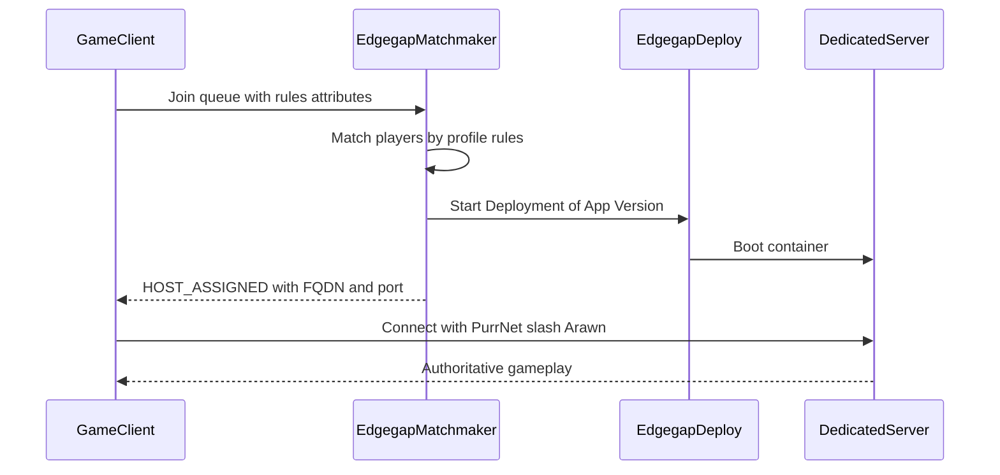

# Edgegap

**Edgegap** is a cloud platform that runs your **dedicated game server** for you — often near your players — so you do not host the match on a player’s PC.

In this documentation space, Edgegap sits under **Server Authoritative**: clients are pure clients; the **server process** Edgegap starts is the authority for gameplay (wired through Arawn + PurrNet on your side).


Edgegap is a **third-party** service. Always cross-check live details in the [official Edgegap docs](https://docs.edgegap.com/). This GitBook explains the workflow in plain language for Game Creator 2 / Arawn / PurrNet creators.


## What problem Edgegap solves

| Without Edgegap (player host) | With Edgegap (dedicated server) |
|-------------------------------|----------------------------------|
| One player’s computer is the “server” | A Linux server runs in the cloud |
| Host disconnect ends the session | Host leaving does not stop the process (until you shut it down) |
| Harder to scale and fair match | Matchmaker can find players, then start a server for them |
| You paste IP/ports by hand | Matchmaking hands out connection details automatically |

## Plain-language glossary

| Term | Meaning |
|------|---------|
| **Dedicated server** | A headless Unity build that runs the game rules without a player sitting at that machine |
| **Docker / container** | A sealed box that contains your server build + Linux OS pieces so it runs the same everywhere |
| **App / Application** | Your game’s server product registered on Edgegap |
| **App Version** | One specific server build (image tag) with CPU, memory, and **port mapping** settings |
| **Deployment** | One running copy of an App Version (a live server instance players can join) |
| **FQDN / Host URL** | The address clients use to find the deployment (for example `abc123.pr.edgegap.net`) |
| **External port** | The public port Edgegap assigns (often random for security); maps to your game’s internal listen port |
| **Matchmaker** | Edgegap service that queues players, applies rules, then starts a Deployment and returns connect info |
| **Ticket / membership** | A player’s place in the matchmaking queue |
| **Profile (queue)** | A named matchmaking “lane” (casual, ranked, coop) with its own rules and App Version |
| **Ping Beacon** | A public network point your game measures latency to, so matches stay region-fair |

## How the pieces fit together

1. You **build** a Linux dedicated server and **upload** it as an App Version ([Configuration and Setup](configuration-and-setup.md)).
2. Players **queue** through Matchmaking; Edgegap **starts** a Deployment when a match is ready ([Matchmaking](matchmaking.md)).
3. Clients **connect** to the assigned host/port using your PurrNet + Arawn networking stack.
4. When the match ends, you **stop** the Deployment so you are not charged for an empty server.

## Pages in this section

| Page | Use it for |
|------|------------|
| [Configuration and Setup](configuration-and-setup.md) | Accounts, Unity tools, Linux build, Docker, App Versions, first cloud Deployment, client connect test |
| [Matchmaking](matchmaking.md) | Full server-authoritative matchmaking: profiles, rules, parties, expansions, connect flow, backfill, server injection |

## Official references

- [Edgegap Getting Started](https://docs.edgegap.com/)
- [Unity — Getting Started](https://docs.edgegap.com/unity)
- [Unity Developer Tools](https://docs.edgegap.com/unity/developer-tools)
- [Matchmaking](https://docs.edgegap.com/learn/matchmaking)
- [Matchmaker In-Depth](https://docs.edgegap.com/learn/matchmaking/matchmaker-in-depth)
- [Ping Beacons](https://docs.edgegap.com/learn/orchestration/ping-beacons)
- [Deployments](https://docs.edgegap.com/learn/orchestration/deployments)

Return to [Server Authoritative Overview](../overview.md).
