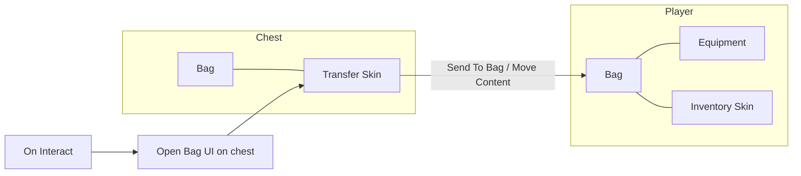

# Bags

A **Bag** is the Inventory module’s runtime container. Attach it to any GameObject — player, chest, merchant, corpse, or stash — and it holds **Items**, **Currencies** (wealth), optional **Equipment**, and per-bag **Cooldowns**. Almost every Inventory flow ends in “open, fill, check, or move a Bag.”

This page covers **how Bags work**. For picker catalogs, see [Instructions](../visual-scripting/instructions.md), [Conditions](../visual-scripting/conditions.md), and [Triggers](../visual-scripting/triggers.md).

Official reference: [Bags](https://docs.gamecreator.io/inventory/bags/) · [Equipment](https://docs.gamecreator.io/inventory/bags/equipment/) · [Bag UI](https://docs.gamecreator.io/inventory/ui/bag-ui/)


Official docs recommend **List** Bags for most projects. Use **Grid** only when you specifically need multi-cell item footprints and packing.


---

## Core concepts

| Concept | Role |
| ------- | ---- |
| **Bag** | Component that stores items and currencies on a GameObject |
| **List / Grid** | Bag type — sequential cells vs 2D multi-cell footprints |
| **Shape** | Capacity geometry (height/width) and optional max weight |
| **Content** | Runtime cells and stacks of items |
| **Wealth** | Currency amounts carried by this Bag |
| **Equipment** | Optional Equipment asset — equippable slots on this Bag |
| **Stock** | Editor defaults for items and wealth applied once on Awake |
| **Skin UI** | Bag Skin prefab (List or Grid UI) opened via **Open Bag UI** |
| **Wearer** | GameObject that wears equipment and is the drop origin (default **Self**) |
| **Overloaded** | Current weight exceeds max weight — does **not** block adding items |

---

## Anatomy of a Bag

The Inspector groups Bag into these areas:

| Section | Purpose |
| ------- | ------- |
| **Bag type** | Switch **List** or **Grid** (arrow on the type row) |
| **Maximum Height / Width** | Hard capacity (List height optional; Grid always finite) |
| **Maximum Weight** | Soft limit — bag becomes overloaded when exceeded |
| **Equipment** | Optional Equipment asset for slots and bone handles |
| **Stock** | Default items (**Add Stock**) and currencies (**Add Wealth**) |
| **Skin UI** | Skin asset whose prefab matches List or Grid |
| **Wearer** | Target for equipment props and world drops |

Internally the Bag also owns **Content** (cells/stacks), **Wealth** (runtime currency map), and **Cooldowns** (timers scoped to this Bag).


Only **one** Bag UI, Merchant UI, or Tinker UI can be open at a time. Opening a Bag UI while another inventory UI is open does nothing.


---

## List vs Grid

| | **List** | **Grid** |
| --- | --- | --- |
| Layout | Vertical sequence of cells | Fixed width × height matrix |
| Cell meaning | One cell per stack root | Each item paints **Width × Height** cells |
| Capacity | Optional **Maximum Height** (cells); width is always 1 | Always finite width and height (common default: 8 × 6) |
| Runtime resize | **Increment Bag Height** | **Increment Bag Height** and **Increment Bag Width** |
| UI | **Bag List UI** | **Bag Grid UI** |
| Best for | Most games, RPGs, chests, merchants | Survival / Tetris-style packing |


**Start with List.** Grid needs matching Grid skins, multi-cell item shapes, and awareness that free cells can still fail if the item footprint does not fit.


---

## Capacity: space vs weight

Two different rules drive “full” vs “overloaded”:

| Constraint | Blocks adding? | Meaning |
| ---------- | -------------- | ------- |
| **Max height** (List) / **grid footprint** | **Yes (hard)** | No free cell or no room for the item shape |
| **Max weight** | **No (soft)** | Items still add; Bag is **Overloaded** when current weight **>** max |


**Overloaded ≠ full.** A Bag still accepts items when overweight. Use **Is Overloaded** for penalties (slow move, block sprint). Use **Can Add** / **Enough Space** for pickup and reward gates.


### Stacking notes

- Adds prefer stacking into compatible existing cells before claiming a new cell.
- List **Maximum Height** limits **cells** (distinct stacks), not total units inside stacks.
- Item **Max Stack** and item shape size still apply from the Item asset.

### Runtime size changes

- **Increment Bag Height** / **Increment Bag Width** only **increase** size.
- Width increment applies to **Grid** only (List width stays 1).
- You cannot shrink a Bag at runtime; Remember also restores shape by growing, not shrinking.

---

## Stock and Wealth

### Stock (editor defaults)

On **Awake**, Stock runs once:

1. Each **Add Stock** entry adds that many of the Item type (stacking allowed).
2. Each **Add Wealth** entry adds currency to this Bag’s Wealth.

| Pattern | Recommendation |
| ------- | -------------- |
| Merchant starter inventory | Stock + Wealth on the merchant’s Bag |
| Fixed chest contents | Stock is fine for a known set |
| Random loot | Prefer **Loot Tables** into the Bag — not Stock |

### Wealth (runtime)

Wealth is a map of currency → amount on **this** Bag. Change it with **Change Currency**, **Move Wealth to Bag**, merchant trades, or conditions like **Compare Wealth**.

Merchant “infinite stock/currency” flags live on the **Merchant** component, not on the Bag itself.

---

## Equipment and Wearer

Assign an **Equipment** asset (**Create → Game Creator → Inventory → Equipment**) so the Bag gains equippable slots.

| Field | Role |
| ----- | ---- |
| **Base Item** (per slot) | Parent Item type the slot accepts (e.g. all helmets under Head) |
| **Bone / Handle** | Where the equipped prefab attaches |
| **Bone override** (on Bag) | Per-instance override — useful for non-humanoids |

Items must already be **in this Bag’s Content**, marked equippable, and inherit from the slot’s Base Item.

**Wearer** defaults to **Self** because the Bag usually sits on the Character. If the Bag is on a child or separate object, point Wearer at the Character that should wear gear and own world drops.

Official detail: [Equipment](https://docs.gamecreator.io/inventory/bags/equipment/)

---

## Skin UI

**Skin UI** references a **Bag Skin** whose prefab contains **Bag List UI** or **Bag Grid UI**. The skin type must match the Bag type or opening fails with a type error.

| Setup | Typical Skin behavior |
| ----- | --------------------- |
| **Player inventory** | Full inventory UI; equip, use, drop, split |
| **Chest / container** | Show contents + **Send To Bag** (or move-all) toward the player Bag |

Key Bag UI ideas (official [Bag UI](https://docs.gamecreator.io/inventory/ui/bag-ui/) covers controls in depth):

- **Prefab Cell** — cell template with **Bag Cell UI**
- **Filter by Parent** — optional Item-type filter (tabs/sections)
- **Can Drop Outside** / **Max Drop Distance** — world drop rules
- **Drop / Transfer / Split Amount** — One vs Stack / Half (also settable via Instructions)
- Drag-and-drop moves items **inside the same Bag**; cross-bag needs Send To Bag, **Move Content to Bag**, or dual UI + **Set Bag UI**

Only items with a **Prefab** on the Item definition can be dropped into the world.

---

## Common setups

| Role | Bag configuration |
| ---- | ----------------- |
| **Player** | List Bag + Equipment + inventory Skin; Remember on the Character |
| **Chest** | Separate Bag + transfer Skin; open on Interact |
| **Merchant** | Merchant’s Bag holds shop Stock/Wealth; client Bag is separate (Merchant UI) |
| **Loot corpse / crate** | Bag filled by Loot Table or Add Item; open or auto-transfer |
| **Bank / stash** | Persistent Bag on a scene or DontDestroy object; transfer via move Instructions |
| **Upgradeable backpack** | Cap List height or Grid size; raise with Increment Height/Width rewards |

---

## Saving

Bags participate in Game Creator’s Remember system via **Memory → Inventory/Bag** (“Remembers the contents of a Bag component”).

Toggleable slices:

| Slice | What is stored |
| ----- | -------------- |
| **Shape** | Max width / height (restore only increases) |
| **Items** | Bag contents |
| **Wealth** | Currencies |
| **Equipment** | Equipped runtime items |
| **Cooldowns** | Per-item cooldown state |


Remember restore is deferred one frame so **Awake Stock** can run first, then saved data replaces it. Do not rely on Stock as “always reapply” on saved objects.


---

## Visual scripting cheat sheet

### Instructions — Bags

| Title | Path | Role |
| ----- | ---- | ---- |
| **Add Item** | Inventory → Bags → Add Item | Create type and add to Bag |
| **Add Runtime Item** | Inventory → Bags → Add Runtime Item | Add existing instance |
| **Remove Item** | Inventory → Bags → Remove Item | Remove by Item type |
| **Remove Runtime Item** | Inventory → Bags → Remove Runtime Item | Remove instance |
| **Drop Item** / **Drop Runtime Item** | Inventory → Bags → … | Remove and spawn near Wearer |
| **Move Content to Bag** | Inventory → Bags → Move Content to Bag | Move all cells (optional wealth) |
| **Move Wealth to Bag** | Inventory → Bags → Move Wealth to Bag | Move all currencies |
| **Increment Bag Height** / **Width** | Inventory → Bags → … | Grow capacity |

### Instructions — Bag UI

| Title | Path | Role |
| ----- | ---- | ---- |
| **Open Bag UI** | Inventory → UI → Open Bag UI | Open Skin; optional wait to close |
| **Close Bag UI** | Inventory → UI → Close Bag UI | Close current inventory UI |
| **Set Bag UI** | Inventory → UI → Set Bag UI | Retarget a Bag UI to another Bag |
| **Set Drop / Transfer / Split Amount** | Inventory → UI → … | One vs Stack / Half modes |
| **Deselect Item UI** | Inventory → UI → Deselect Item UI | Clear selection |

### Conditions

| Title | Use when |
| ----- | -------- |
| **Can Add** | Specific Item type fits the destination Bag |
| **Enough Space** | Free cell count ≥ minimum |
| **Has Item** / **Has Runtime Item** | Presence checks |
| **Is Overloaded** | Weight surpassed — soft limit reaction |
| **Is Bag UI Open** | Gate input or pause while UI is open |
| **Compare Wealth** | Currency thresholds |

### Triggers / Events

| Title | Fires when |
| ----- | ---------- |
| **On Add** | Item added to Bag (optional type filter) |
| **On Remove** | Item removed from Bag |
| **On Open Bag UI** / **On Close Bag UI** | Bag UI lifecycle |
| **On Change Currency** | Wealth on Bag changes |
| **On Equip** / **On Unequip** | Equipment on Bag (Equipment category) |

Useful GameObject properties: **Bag**, **Current Open Bag**, **From Bag UI**, plus Merchant/Tinker bag getters when those UIs are active.

Official instruction index: [Bags instructions](https://docs.gamecreator.io/inventory/visual-scripting/instructions/inventory/bags/)

---

## Patterns that work well



### Gate pickups before rewarding

Before **Add Item** or a Loot Table into the player Bag, check **Can Add** (or **Enough Space**). On failure, leave the world pickup, show feedback, or open the Bag UI so the player can make room.



### Soft weight as gameplay

Enable **Maximum Weight**. On **Is Overloaded** (or after **On Add**), apply Stats / motion penalties. Do not expect weight alone to block looting.



### Chest transfer

Put a Bag + transfer Skin on the chest. **On Interact** → **Open Bag UI**. Cell **On Choose → Send To Bag** (player Bag), or run **Move Content to Bag** for loot-all.



### Persist the player Bag

Add Remember with **Memory → Bag** on the player (or bag object). Test load once: confirm Stock does not fight saved contents.



---

## Gotchas checklist

1. Height/grid space is hard; weight is soft.
2. List max height = max **cells**, not total stacked units.
3. Grid can fail **Can Add** with empty cells that do not fit the item shape.
4. Skin List/Grid must match Bag type.
5. Only one of Bag / Merchant / Tinker UI open at once.
6. Wearer **Self** is wrong if the Bag is not on the Character.
7. Cross-bag drag is not automatic — use Send To Bag or move Instructions.
8. Equipped items may block send/transfer unless the UI path allows sending equipment.
9. World drop needs Item Prefab + drop allowed + valid Wearer.
10. Cannot decrease Bag dimensions at runtime or via save restore.
11. Stock is Awake-only; Remember overrides afterward on saved Bags.

---

## Scene setup tips

- Add **Game Creator → Inventory → Bag** (or the Bag component) on the player early; assign Equipment and Skin before wiring Triggers.
- Keep player and chest as **separate Bags** — do not share one Bag across both roles.
- For companions with their own inventory, give each a Bag and an explicit Wearer if needed.
- Study demo packages locally: `Inventory.UI`, `Inventory.Examples`, `Inventory.Adventure`, `Inventory.Items`.

---

## Related

- [Core Functionality overview](overview.md) — Inventory systems hub
- [Instructions](../visual-scripting/instructions.md) — Bags, UI, currency Actions
- [Conditions](../visual-scripting/conditions.md) — Can Add, Enough Space, Is Overloaded
- [Triggers](../visual-scripting/triggers.md) — On Add, On Remove, Bag UI events
- [Space homepage](../README.md) — Inventory module overview
- Official: [Bags](https://docs.gamecreator.io/inventory/bags/) · [Bag UI](https://docs.gamecreator.io/inventory/ui/bag-ui/) · [Equipment](https://docs.gamecreator.io/inventory/bags/equipment/)
