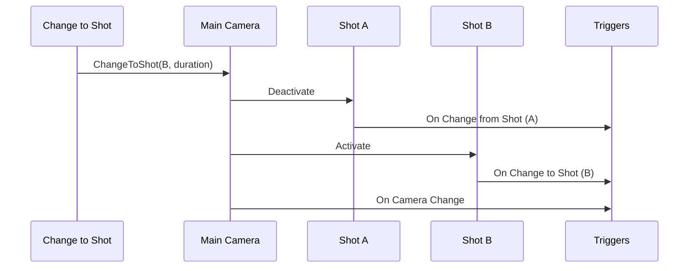

# Triggers

Core Camera Triggers

On Camera Change · On Change to Shot · On Change from Shot

Game Creator 2 cameras use a **Main Camera** (`TCamera`) that blends between **Shot Camera** components. Shot switches are usually started with the [**Change to Shot**](instructions.md) instruction (Cameras → Change to Shot).

| | On Camera Change | On Change to Shot | On Change from Shot |
| -- | -- | -- | -- |
| **Watches** | Main Camera | One Shot Camera | One Shot Camera |
| **Fires when** | Any shot switch on that camera | That shot becomes active | That shot becomes inactive |
| **Cut vs transition** | Filterable | Both | Both |
| **Best for** | Global camera reactions | Entering a specific angle | Leaving a specific angle |

On Camera Change

**Type:** Trigger event\
**Category:** Cameras / On Camera Change\
**Component:** Trigger (on any Game Object)

**Summary:** Runs when the selected Main Camera switches to a different Shot Camera.

**When it runs:** Whenever a shot change is committed on that camera—either an instant **cut** (zero duration) or a **transition** (duration greater than zero). Use **When** to listen to all changes, cuts only, or transitions only.

**Requirements:** **Camera** must reference a GameObject with a **Main Camera** (`TCamera`) component. If the reference is missing or invalid, the event never fires.

**Inputs (inspector fields):**

| Field | Default | Purpose |
| -- | -- | -- |
| **Camera** | Main Camera | Which camera rig to watch |
| **When** | Any Change | **Any Change**, **On Cut**, or **On Transition** |


**Cut** = instant switch (duration ≈ 0). **Transition** = blended switch over time with easing. Set **When** to **On Transition** for cinematic blends only, or **On Cut** for snap changes only.


**Outputs / context:** **Self** is the GameObject with the Trigger component. The new or previous shot is not passed into the graph automatically—use Game Object getters in Actions if needed.

**Notes:** Fires at the **start** of the switch, not when a transition finishes.

**Related:** [Change to Shot](instructions.md) · On Change to Shot · On Change from Shot

On Change to Shot

**Type:** Trigger event\
**Category:** Cameras / On Change to Shot\
**Component:** Trigger (on any Game Object)

**Summary:** Runs when the specified Shot Camera becomes the active shot on a Main Camera.

**When it runs:** After the previous shot is deactivated and this shot is enabled. Fires for both cuts and transitions.

**Requirements:** **Camera Shot** must reference a GameObject with a **Shot Camera** component.

**Inputs (inspector fields):**

| Field | Default | Purpose |
| -- | -- | -- |
| **Camera Shot** | (instance) | The shot to watch—drag from the hierarchy or use a variable |

**Typical uses:** Enable shot-specific UI, start ambient audio, show prompts, or set global variables when entering a cinematic or gameplay angle.

**Notes:** Pair with **On Change from Shot** on the same shot for enter/exit logic. Use **On Camera Change** on the Main Camera when you need one reaction for every switch.

**Related:** On Change from Shot · On Camera Change · [Change to Shot](instructions.md)

On Change from Shot

**Type:** Trigger event\
**Category:** Cameras / On Change from Shot\
**Component:** Trigger (on any Game Object)

**Summary:** Runs when the specified Shot Camera stops being the active shot.

**When it runs:** When another shot replaces this one. Runs **before** the new shot's **On Change to Shot**.

**Requirements:** **Camera Shot** must reference a GameObject with a **Shot Camera** component.

**Inputs (inspector fields):**

| Field | Default | Purpose |
| -- | -- | -- |
| **Camera Shot** | (instance) | The shot that is leaving |

**Typical uses:** Hide shot-specific UI, stop localized audio, reset overrides, or save state when leaving an inspection or aim camera.

**Notes:** Use for cleanup; use **On Change to Shot** for setup on the same shot.

**Related:** On Change to Shot · On Camera Change


If **Camera** or **Camera Shot** does not resolve to the correct component, the trigger subscribes to nothing and **never runs**—no error is shown in Play Mode.


Core Audio Triggers

On Change Ambient Volume

On Change Master Volume

On Change Music Volume

On Change Sound Effects Volume

On Change Speech Volume

On Change UI Volume

Core Character Triggers

On Become NPC

On Become Player

On Change Model

On Die

On Revive

Core Character Combat Triggers

On Defense Change

On Dodge

On Invincibility Change

On Poise Break

On Poise Change

On Target Change

Core Character Navigation Triggers

On Dash

On Jump

On Land

On Step

Core  Character Ragdoll Triggers

On Recover Ragdoll

On Start Ragdoll

Core Input Truggers

On Cursor Click

On Input Button

On Input Flick

On Touch

Core Lifecycle Triggers

On App Focus

On App Pause

On App Quit

On Become invisible

On Become Visible

On Disable

On Enable

On Fixed Update

On Interval

On Invoke

On Late Update

On Start

On Update

Core Interactive Triggers

On Blur

On Focus

On Interact

